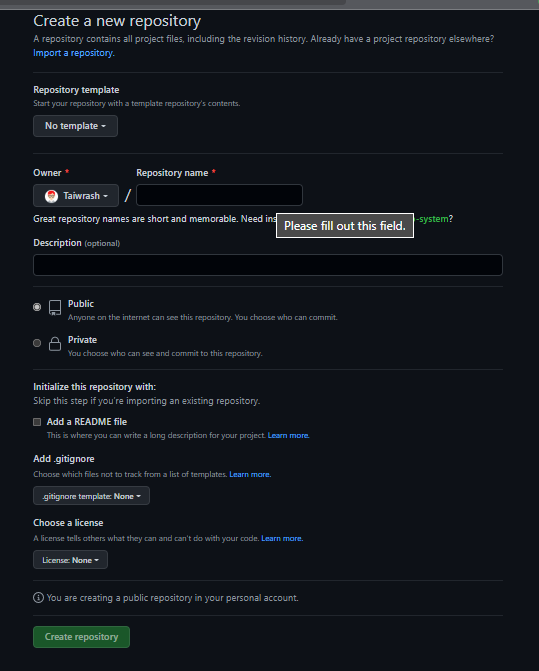
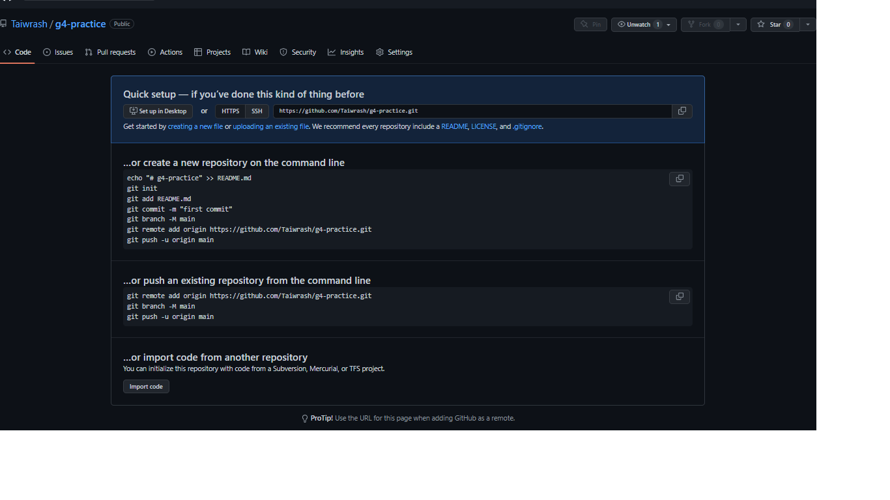

## GitHub

```markdown
    :+1 BIG SHOUT OUT TO GITHUB FOR SPONSORING THIS WORKSHOP 
    > Let's make some noise!
    -   Hashtags: #githubforsummit22, @GitHubEducation @GitHub @Ibn_mudathir #SUNO
```
>  In this module, participants will be able to setup there GitHub account, create a repository and connect the local repository with the newly created repository and redeem their [**GITHUB STUDENT DEVELOPERS PACKS**](https://education.github.com/discount_requests/student_application?utm_source=2022-07-30-GITHUBFORSUMMIT)

###  What is GitHub
>   According to the wikipedia page, GitHub, Inc. is a provider of Internet hosting for software development and version control using Git. It offers the distributed version control and source code management (SCM) functionality of Git, plus its own features.

### Why GitHub

>  Learn how to start building, shipping, and maintaining software with GitHub. Explore our products, sign up for an account, and connect with the world's largest development community.

[GitHub in 3-Minutes](https://www.youtube.com/watch?v=w3jLJU7DT5E)
You've collaborated locally with your team on a single network. It is time to decentralise your team across the globe. Collaboration can only be done over internet. GitHub helps integrates the experience in Git on the internet. Remote work are possible for software engineers and their team through the help of source code management system like GitHub.

### Creating Account

We will be using the [magic link](https://education.github.com/discount_requests/student_application?utm_source=2022-07-30-GITHUBFORSUMMIT) to create account in this workshop for easy access to GitHub Student Developers Pack. 

> Quick Notice: Use your student email while registering using this link.

### GitHub Student Developers Pack Application

-   Step 1: Click on ```student``` then click on ```get your student pack``` button. 

-   Step 2: Fill out the form with account just created with your student email.

-   Step 3: The application will be review and you will receive an acceptance email

### Creating a GitHub Repository

-   [Simple Steps]()

> Quick notice: Don't initialise README (leave the button uncheck)



### Connect Local Repo to GitHub Repo

-   Follow the instruction after creating a repo without initializing README

    

>   Finally, after running all the commands refresh your GitHub browser


[<< Previous Module](/2-basic-git-commands.md)<============================>[Next Module >>](/4-git-in-vscode.md)