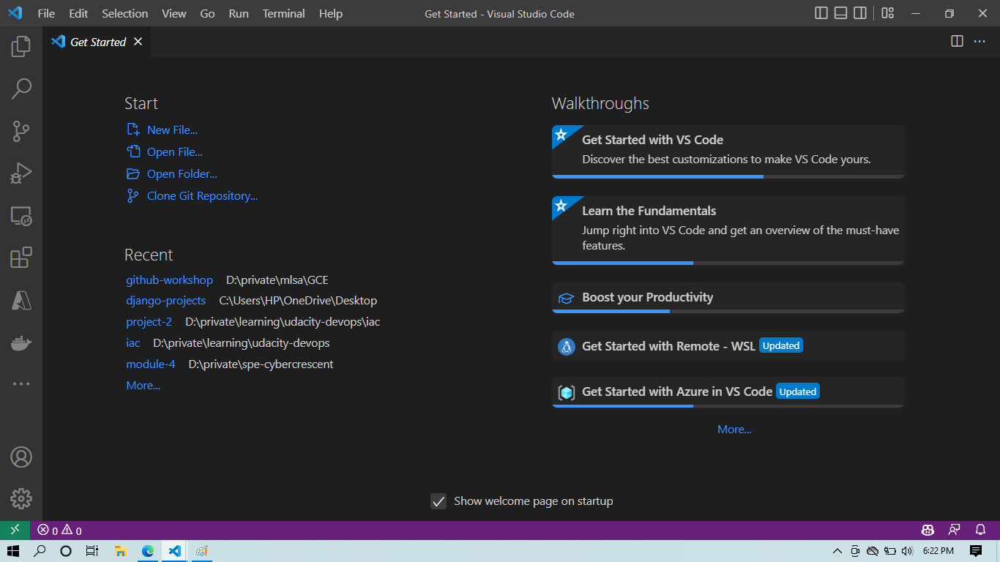
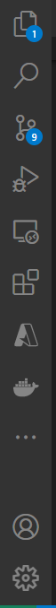
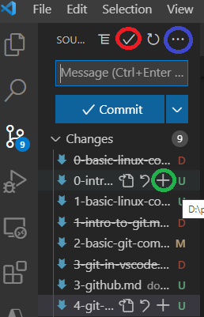
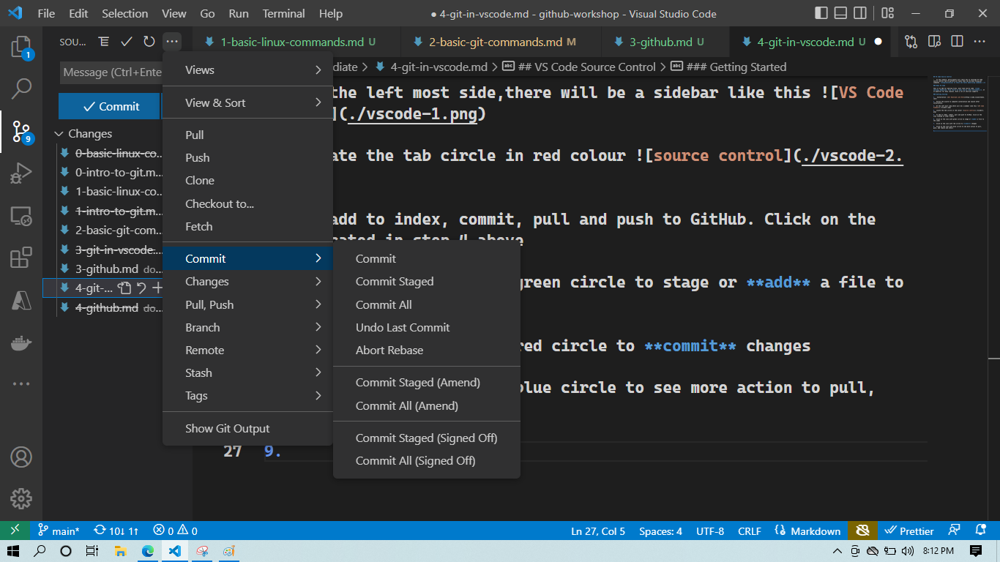

## VS Code Source Control

>   In this module, participants will learn how to leverage VS Code source control tab to perform all tasks that can be done using git commands. **Congratulations to those who hates memorising commands ):**

### What VS **Code** 

This is an IDE for editing files, most time source code. **Code editing. Redefined. Free. Built on open source. Runs everywhere.**. It is powerful for many reasons. With a lot of shortcut supports

### Getting Started

1.   Installation: [Get Download Link Here](https://code.visualstudio.com/)

2.  Follow the wizard to complete installation and launch after installation.

3.  VS Code quick walk through 

    

4.  At the left most side,there will be a sidebar like this 

    

5.  Locate the tab circle in red colour 
   
   

6.  To add to index, commit, pull and push to GitHub. Click on the icon located in step 4 above

7.  Click on the icon with green circle to stage or **add** a file to the index

8.  Click on the icon with red circle to **commit** changes

9.  Click on the icon with blue circle to see more action to pull, push, add remote and others

    

9.  Other Actions

    

### Exercise

-   Create a new folder
-   Create a new file and add anything inside
-   Create a GitHub repository
-   Use VS Code source control to push to GitHub

[<< Previous Module](3-github.md)<============================>[Next Module >>](5-github-tabs.md)