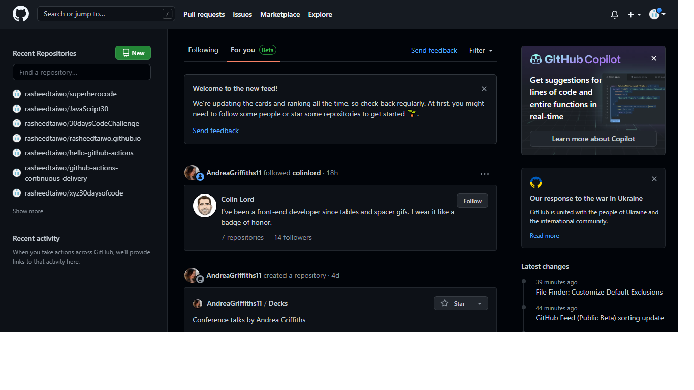
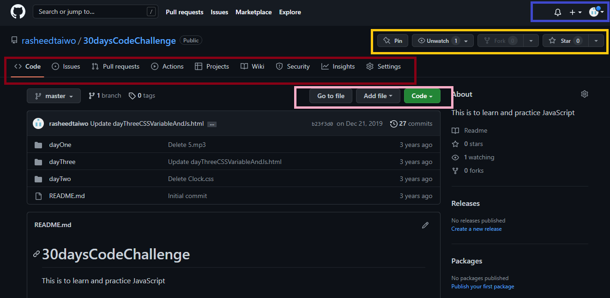
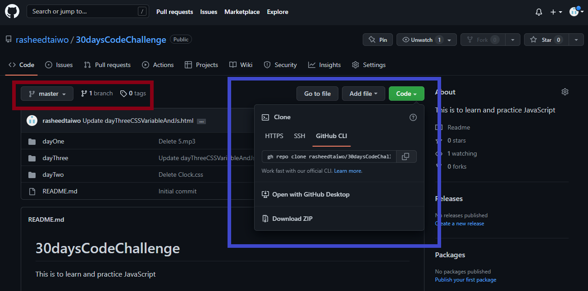

## GitHub Overview

>   In this module, participants will learn all the actions of every tab on GitHub

### The User Page

>   Learn how to start building, shipping, and maintaining software with GitHub. Explore our products, sign up for an account, and connect with the world's largest development community.

### The Tabs 

1.  Code Tabs (Mark Red)

-   Issues
>    GitHub Issues are use to track ideas, feedback, tasks, or bugs for work on GitHub.

    This gives access to discussion and interactions. When a conversation in an issue is better suited for a discussion, you can convert the issue to a discussion.

-   Pull Request

>   This works better with branches. Branches allow you to develop features, fix bugs, or safely experiment with new ideas in a contained area of your repository. You always create a branch from an existing branch. Typically, you might create a new branch from the default branch of your repository. You can then work on this new branch in isolation from changes that other people are making to the repository. A branch you create to build a feature is commonly referred to as a feature branch or topic branch

-   Actions

>   Automate, customize, and execute your software development workflows right in your repository with GitHub Actions. You can discover, create, and share actions to perform any job you'd like, including CI/CD, and combine actions in a completely customized workflow.

-   Code

> Take user back to the root directory.

2.  Profile Tab (Mark Blue)

-   User have access to view, edit and share their profile to the world.

3.  Reaction Tabs (Mark Yellow)

-   This is where you reacts and set notifications on a particular repository.

>   -   star tab gives ability to give the repo more credibility and visibilities.
>   -   fork tab gives ability to a remote copy of a public repo which other created. 

1.  Action Tabs (Mark Pink)

-   This gives user ability to add, edit and commit files, images and folders.

>   -   Code gives user access to copy https, ssh links and even url to connect to GH CLI 

>   In the above image, the red circle is where you switch between branches.

### Exercise

1.  Create a repository with add README input checked during creation
2.  Upload files, images using the Action tabs mark pink in the above and commit uploaded file
3.  Click setting tab and locate delete button to delete the repository

[<< Previous Module](/docs/beginner-intermediate/4-git-in-vscode.md)<============================>[Next Module >>](/docs/beginner-intermediate/6-mdx-conclusion.md)