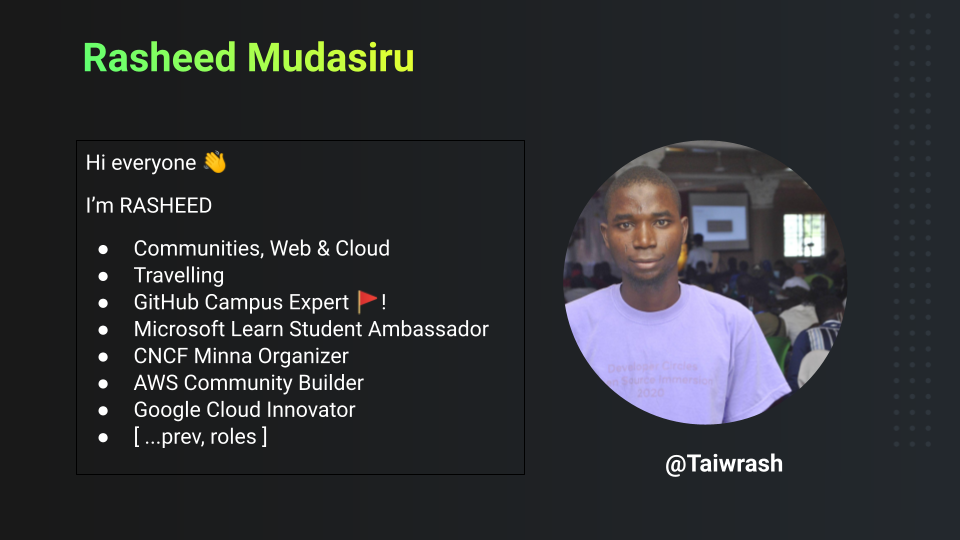
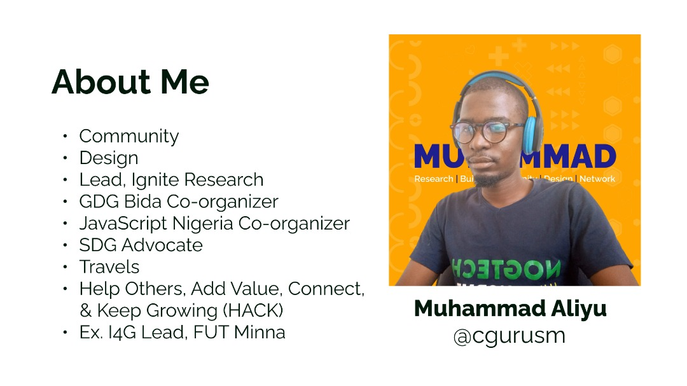

#   Getting Good at Git and GitHub (G4)

##  Welcome to GitHub for Summit Workshop

You can use the [editor on GitHub](https://github.com/Taiwrash/g4-workshop/edit/main/docs/index.md) to start contributing.

 We plan to take the participants of this workshop from no knowledge or average knowledge of Git and GitHub to intermediate level and be able to contributes to **open source**, enterprises and personal projects.

### Our Goal!
> We plan to take the participants of this workshop from no knowledge or average knowledge of Git and GitHub to intermediate level and be able to contribute to open **source**, enterprises and personal projects.

This is also a simplified form of the [documentations](https://docs.github.com/en) to be taken in maximum of seven (7) days by taking a single module in a day.

# WHOAMI

## GitHub Student Programs

[Student Opportunities Slide by RASHEED(@Taiwrash)](https://docs.google.com/presentation/d/1LpfZylx1ZFlzrFec-i-yvgjd5H-YnxASrWH1vDCxkq8/edit?usp=sharing)

### Navigation guides

These projects are focused on the below seven sub-sections and contains exercises at the end of every modules.

1.  [Introduction to Git](/beginner-intermediate/0-intro-to-git.md)
2.  [Basic Linux Commands](/beginner-intermediate/1-basic-linux-commands.md)
3.  [Basic Git Commands](/beginner-intermediate/2-basic-git-commands.md)
4.  [GitHub](/beginner-intermediate/3-github.md)
5.  [Git Source Control in VSCode](/beginner-intermediate/4-git-in-vscode.md) 
6.  [GitHub Tabs](/beginner-intermediate/5-github-tabs.md)
7.  [MDX and Conclusion](/beginner-intermediate/6-mdx-conclusion.md)

### Recommendations

Participants are adviced to take their time to understand each of the modules before moving to the next module.

### Note to everyone

> This is an open source projects, feel free to create issues and make pull request to improve the quality and help somebody to learn

### Author Socials

-   [GitHub @Taiwrash](https://github.com/Taiwrash)
-   [Twitter @Ibn_mudathir](https://twitter.com/Ibn_mudathir)
-   [Linkedin @Rasheed Mudasiru](https://linkedin.com/in/rasheedtaiwo)